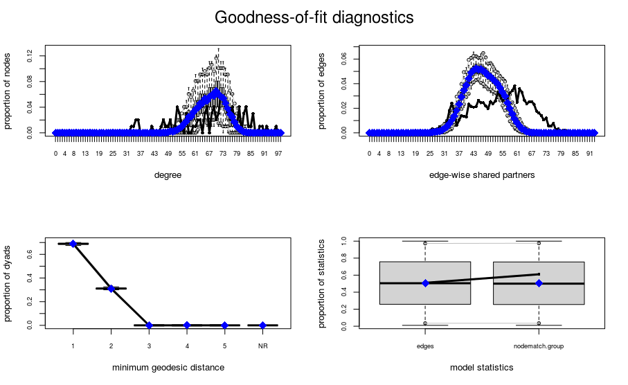

```{r echo=FALSE,results='hide', message=FALSE}
library(curl)
library(igraph)
library(ggplot2)
library(stats)
source("helpers.R")
library(gridExtra)
library(DT)
```
\newpage
\setcounter{tocdepth}{2}
\tableofcontents
\newpage

# Introduction

Ant colonies have a complex and fascinating social structure that may bring answers to a multitude of scientific questions. Usually the nests are organized in a stratified manner with a queen at the center and numerous workers doing tasks needed for the upkeep of the colony. The study [@antpaper] for which the data we worked on was collected sought to understand the social structure of *Camponotus fellah* ants: What are the groups inside the colonies and what factors define them. 

## The data

The original data of the study consist of more than 9 million observed interactions between ants collected for 41 days from ants belonging to 6 colonies. For our project we decided to work on a specific graph for a given day and network. Our random choice was day 17 and colony 1. All following work will be based on this sample graph and thus only, represents a small example of the whole experiment.

### Preliminary data exploration

In the following section we will show how the data is structured for the single colony and the single day (namely day 17, colony 1). We will start by loading the data using the `get_graph` function that we built previously and is attached to this project.

```{r echo=FALSE, results='hide'}
g <- get_graph(colony = 1, day = 17)
```

Next we will have a look at the vertices of the graph with the command `vcount`. There are 99 of them in this graph.

```{r echo=FALSE, results='hide'}
vcount(g)
```
Next we displayed the number of edges with the `ecount` command. There are over 3300 edges. In detail for day 17, for the first colony there were over 3342 interactions between 99 ants.
```{r echo=FALSE, results='hide'}
ecount(g)
```

```{r echo=FALSE, fig.height=4}
#to_table<-head(do.call(cbind,vertex.attributes(g)))
#tab <- t(to_table[-1,])
#colnames(tab) <- c("1", "2", "3", "4", "5")
#knitr::kable(tab, digits = 2, caption="Excerpt of the attributes")
```
Each vertex has also a set of attributes like:

* Several attributes that are useful for understanding the interactions of the studied ants

* Attributes that register the visits of the ant to important places of the colony (like the brood or the nest entrance)

* The groups fitted by the authors of the study

* The age of the ant (measured in days)

* The body size of the ant (in mm)

Outside of these listed attributes there are more variables in the data that will be used during our analisys. 

### Plot

We will have a look at the plot of the whole network and a separate plot for each group. The color corresponds to the group of the ant and the size to its degree. We see that there is a difference in the group sizes  with the nurses being the smallest group. Some ants have high degrees while some are rather separated. Yet, there are no ants with a very high degree. We can find some ants with a very low degree though. In general the network looks not too heterogeneous.

```{r, echo=FALSE, fig.width=6, fig.height=4}
library(scales)
G <- g
G_Grouped = G

## Add edges with high weight between all nodes in the same group
for(i in unique(V(G)$group)) {
  GroupV = which(V(G)$group == i)
  G_Grouped = add_edges(G_Grouped, combn(GroupV, 2), attr=list(weight=10))
} 

## Now create a layout based on G_Grouped
set.seed(123)
LO = layout_with_fr(G_Grouped)

V(G)$group <- as.factor(V(G)$group)
degs <- rescale(degree(G), c(0,1))
## Use the layout to plot the original graph
plot(G, vertex.label = NA, vertex.color=V(G)$group, layout=LO, vertex.size = degs * 13, main="Plot of the Network")
legend('topleft',legend=c("NA", "Cleaners", "Foragers", "Nurses", "Queen"), col='black', pch=21, pt.bg=categorical_pal(5))
```

```{r echo=FALSE, fig.width=7, fig.height=3}
foragers <- induced_subgraph(g, which(V(g)$group=="F"))
nurses <- induced_subgraph(g, which(V(g)$group=="N"))
cleaners <- induced_subgraph(g, which(V(g)$group=="C"))

groups <- list(Foragers=foragers, Nurses=nurses, Cleaners=cleaners)

par(mfrow=c(1,3))

tmp <- lapply(seq_along(groups), function(u){
  degs <- rescale(degree(groups[[u]]), c(0,1))
  plot(groups[[u]], main = paste(names(groups)[u]), vertex.label=NA, vertex.size = degs * 13, vertex.color="white")
  })
```

As we can see the foragers and cleaners groups contain more ants than the nurses group and they also contain more interactions. The nurses seem to be less connected and are structured a bit differently compared to the other groups.

## The original paper

The original paper was written by: Danielle P. Mersch, Alessandro Crespi and Laurent Keller and explores questions related to how can we separate ant colonies into groups and what makes ants change the group they belong to. During their study they found 3 main groups based on the interactions between ants and concluded that age is the main factor that determines ants to change the group they are part of. All colonies studied had 4-years old queens and between 122 and 192 workers per colony. Each ant was marked and followed individually and an interaction between two ants were defined by the fact that "the front end of one ant was located within thetrapezoidal shape representing the other ant".

## Our questions

The goal of this work is to conduct the given data set w.r.t. various aspects. Furthermore, a validation of the key results of the original paper is carried out. For this the chosen sample colony is used. On this network the analysis is to be done.

We will first explore the network in a descriptive manner. This includes characteristics like degree distribution, density, diameter and more. In the second step we have a closer look at the groups. First, we validate that the three groups are a valid proposal for the given network. This is done by running a clustering algorithm on the network to identify the groups which will be compared to the labeled groupings. Second, we investigate how frequently ants communicate within groups and compare this to the level of communication between groups. We investigate on the question how fast information can be spread in the network. Additionally, we calculate the centrality of specific ants or groups (e.g. the queen) w.r.t. different measures. Furthermore, we review several properties of the ants and their correlation with the groups (e.g. age, size). Then we also try different models on this network and evaluate their performance.

#  Descriptive Statistics of the Network

As we noted above the data we are going to use for our analysis refers to the movements of the ants of the first colony in day 17 of the study. Thus the graph has 99 vertices and 3342 edges. We must also note that the graph is connected.

## Statistics of Attributes

As mentioned before, there are several attributes that describe each ant. In the following sub-section we will analyze two of those, namely the age and the body size of the ant and then we will highlight differences in regard to this attributes for each category of ants (as defined by the authors of the study).

```{r echo=FALSE, results='hide'}
# Here we select and transform the relevant variables into a data frame 
atributes<-vertex.attributes(g)
atributes1<-data.frame(
  id=atributes$name,
  group=atributes$group,
  cathegory=rep("age",length(atributes$name)),
  val=atributes$`age(days)`
)
atributes2<-data.frame(
  id=atributes$name,
  group=atributes$group,
  cathegory=rep("size",length(atributes$name)),
  val=atributes$body_size
)
atr<-rbind(atributes1,atributes2)
atr<-atr[atr$group!="",]
str(atr)
```

### Body Size

```{r echo=FALSE, fig.width=7, fig.height=2}
body_size_boxplot <- ggplot(atr[atr$cathegory=="size",])+aes(x=group,y=val)+geom_boxplot()
body_size_boxplot <- body_size_boxplot + labs(x="Group", y="Size (mm)",title="Boxplot of Body Size")

body_size_hist <- ggplot(atr[atr$cathegory=="size",])+aes(x=val)+geom_histogram(binwidth=10)+xlab("size")
body_size_hist <- body_size_hist + labs(x="Size (mm)", y="Count",title="Histogram of Body Size")

grid.arrange(body_size_boxplot, body_size_hist, ncol=2)

```
It can be easily seen that the queen has a much greater body size than the ants of the other groups. There is little difference between ants of the three groups in regard to this variable. Furthermore, most ants had a body size of around 150 mm with just a few of them having greater body sizes.


```{r echo=FALSE, message=FALSE}
atr_size<-atr[atr$cathegory=="size",]
# The series are not normally distributed with the exception of group "N"
mean_table_size <- aggregate(val~group,data=atr_size,mean)
results<-data.frame(group=mean_table_size$group[1:3],av_size=mean_table_size$val[1:3],Shapiro_pi=rep(0,3))
for(i in 1:3){
temp<-shapiro.test(atr_size$val[atr_size$group==results$group[i]])
results$Shapiro_pi[i]<-temp$p.value
}
colnames(results) <- c("Group", "Average Size", "Shapiro p-val")
results_size <- results
# The series are not that different
wt_size_cf <- wilcox.test(atr_size$val[atr_size$group=="C"],atr_size$val[atr_size$group=="F"]) 
wt_size_cn <- wilcox.test(atr_size$val[atr_size$group=="C"],atr_size$val[atr_size$group=="N"])
wt_size_fn <- wilcox.test(atr_size$val[atr_size$group=="F"],atr_size$val[atr_size$group=="N"])
```


As the data for body size for ants in groups C and F is not normally distributed we preferred to use the Wilcoxon rank sum exact test in order to check whether there is any difference between the means of the body sizes of the three groups. As the results of the test yields p-values way above 0.05 we can conclude that the three groups have roughtly equal body sizes.

### Age

```{r echo=FALSE, fig.width=7, fig.height=2}
age_boxplot <- ggplot(atr[atr$cathegory=="age",])+aes(x=group,y=val)+geom_boxplot()
age_boxplot <- age_boxplot + labs(x="Group", y="Age (days)",title="Boxplot of Age")

age_hist <- ggplot(atr[atr$cathegory=="age",])+aes(x=val)+geom_histogram(binwidth=10)
age_hist <- age_hist + labs(x="Age (days)", y="Count",title="Boxplot of Age")

grid.arrange(age_boxplot, age_hist, ncol=2)

```


The boxplots show that most ants have similar ages, with the exception of the queen which is much older than the other ants. The groups do not seem to be different in age.
The histogram shows a pike around the age of 300 days. Most ants are younger than 500 days and they are born in "waves".

```{r echo=FALSE, message=FALSE, warning=FALSE}

atr_age<-atr[atr$cathegory=="age",]
# The series are not normally distributed
mean_table_age <- aggregate(val~group,data=atr_age,mean)
results<-data.frame(group=mean_table_age$group[1:3],av_size=mean_table_age$val[1:3],Shapiro_pi=rep(0,3))
for(i in 1:3){
temp<-shapiro.test(atr_age$val[atr_age$group==results$group[i]])
results$Shapiro_pi[i]<-temp$p.value
}
colnames(results) <- c("Group", "Average Age", "Shapiro p-val")
results_age <- results
# The series are not that different
wilcox.test(atr_age$val[atr_age$group=="C"],atr_age$val[atr_age$group=="F"])
wilcox.test(atr_age$val[atr_age$group=="C"],atr_age$val[atr_age$group=="N"])
wilcox.test(atr_age$val[atr_age$group=="F"],atr_age$val[atr_age$group=="N"])
```

The Wilcoxon rank test shows again that there is no difference in mean age between the three groups.

```{r echo=FALSE}
knitr::kable(list("Shapiro Tests Age"=results_age, "Shapiro Tests Size"=results_size), caption = "Shapiro Test Results") #to discuss
```


## For the General Network

```{r,echo=FALSE,results='hide'}
g <- get_graph(colony = 1, day = 17)
```

```{r,echo=FALSE,results='hide', fig.width=4, fig.height=2, fig.align='center'}
degrees<-data.frame(degree=degree(g))
ggplot(degrees)+aes(x=degree)+geom_histogram(binwidth = 10)+ggtitle("Histogram of the Degrees") + labs(x="Degree", y="Count")
```
```{r, echo=FALSE}
out.df <- data.frame(
  length(degrees[degrees[,1]<=30,]),
  length(degrees[degrees[,1]<=60,]),
  length(degrees[degrees[,1]<=90&degrees[,1]>60,]),
  length(degrees[degrees[,1]>90,]),
  min(degrees),
  max(degrees)
)
colnames(out.df) <- c("[0-30]", "(30-60]", "(60-90]",  ">90", "Min", "Max" )
knitr::kable(out.df, caption = "Distribution of the degrees")
```


Most nodes have a rather higher degree (between 60 and 90) and there are some nodes with a lower value of the degree, thus we can infer that most ants had a higher number of contacts while some ants had less frequent meetings. There is a small number of nodes that has a very high degree (over 90), they represent ants that had a lot of encounters. We must also note that no ant had less than 33 encounters.


### Measures of Centrality

```{r, echo=FALSE}
deg <- centralization.degree(g)
deg <- data.frame(index=factor(1:length(deg$res),levels=1:length(deg$res)),deg=deg$res[order(deg$res, decreasing = TRUE)])
plot_deg_cent <- ggplot(deg)+aes(y=deg,x=index)+geom_col(width=1)+
  theme(axis.title.x = element_blank(),
        axis.text.x=element_blank(),
        axis.ticks.x=element_blank())
plot_deg_cent <- plot_deg_cent + labs(title = "Degree Centrality", y="Value")

deg <- centralization.closeness(g)
deg <- data.frame(index=factor(1:length(deg$res),levels=1:length(deg$res)),closeness_centrality=deg$res[order(deg$res, decreasing = TRUE)])
plot_closeness_cent <- ggplot(deg)+aes(y=closeness_centrality,x=index)+geom_col(width=1)+
  theme(axis.title.x = element_blank(),
        axis.text.x=element_blank(),
        axis.ticks.x=element_blank())
plot_closeness_cent <- plot_closeness_cent + labs(title = "Closeness Centrality", y="Value")

deg <- centralization.betweenness(g)
deg <- data.frame(index=factor(1:length(deg$res),levels=1:length(deg$res)),betweenes_centrality=deg$res[order(deg$res, decreasing = TRUE)])
plot_betweenness_cent <- ggplot(deg)+aes(y=betweenes_centrality,x=index)+geom_col(width=1)+
  theme(axis.title.x = element_blank(),
        axis.text.x=element_blank(),
        axis.ticks.x=element_blank())
plot_betweenness_cent <- plot_betweenness_cent + labs(title="Betweenness Centrality", y="Value")

deg <- centralization.evcent(g)
deg <- data.frame(index=factor(1:length(deg$vector),levels=1:length(deg$vector)),eigenvalue_centrality=deg$vector[order(deg$vector, decreasing = TRUE)])
plot_ev_cent <- ggplot(deg)+aes(y=eigenvalue_centrality,x=index)+geom_col(width=1)+
  theme(axis.title.x = element_blank(),
        axis.text.x=element_blank(),
        axis.ticks.x=element_blank())
plot_ev_cent <- plot_ev_cent + labs(title="Eigenvalue Centrality", y="Value")

deg <- page.rank(g)
deg <- data.frame(index=factor(1:length(deg$vector),levels=1:length(deg$vector)),page_rank=deg$vector[order(deg$vector, decreasing = TRUE)])
plot_pr_cent <- ggplot(deg)+aes(y=page_rank,x=index)+geom_col(width=1)+
  theme(axis.title.x = element_blank(),
        axis.text.x=element_blank(),
        axis.ticks.x=element_blank())
plot_pr_cent <- plot_pr_cent + labs(title="Page Rank", y="Value")
```

```{r, echo=FALSE, fig.width=10, fig.height=2}
grid.arrange(plot_deg_cent, plot_closeness_cent, plot_betweenness_cent, plot_ev_cent, plot_pr_cent, ncol=5)
```

In regard to betweenness centrality we can observe that one ant ranks far over the others, thus we can conclude that there is one ant that has a very central role in the network a conclusion we couldn't draw based on the other measures of centrality.


The eigenvalue centrality presents a decreasing structure although it is a smoother decrease compared to the one of the betweenness centrality, in this case we can find no node that is much more "central" that the others.

The page rank of the nodes of the graph presents a structure in which there are several dominating nodes that have a much higher rank than the others.

### Average Path Length, Diameter and Clustering Coefficient

The average path length can show how connected the analyzed network is. In the case of our graph the value is approximately 1.31 (`average.path.length`). Another measure of the connectivity of the graph is its diameter (the maximum of the series of shortest paths), the value of the indicator is: 5 (`diameter`). The clustering coefficient of the whole graph is 0.776 (`transitivity`), we will compare it to those of the groups in the next sections.
```{r echo=FALSE, results='hide'}
average.path.length(g)
diameter(g)
transitivity(g)
```


## By Group

Before looking at the following summary statistics per group it is important to know about the size of each group. There are 50 ants in the group foragers, 27 cleaners and 18 are nurses. This means the following results need to be considered under the fact of this unequal distribution of group members.

### Histogram and Density

The foragers have a rather wider spread of degrees compared to the other two groups. Most of them have a degree greater than 40. The other two groups are distributed very homogeneously. It is notable though that there is a hierarchy of degrees starting from the low degree group of nurses to the mid-range group of cleaners over to the higher degree group of foragers.

```{r echo=FALSE, fig.width=7,fig.height=2}
par(mfrow=c(1,3))
tmp <- lapply(names(groups), function(u) hist(degree(groups[[u]]), freq = FALSE, 
                                       main = paste("Histogram of", u), xlab = "Degree"))
```

```{r, echo=FALSE, fig.width=7,fig.height=2}
tmp <- lapply(seq_along(groups), function(u){
  deg_dist <- data.frame(value = degree_distribution(groups[[u]]), deg=1:(max(degree(groups[[u]]))+1))
  p <- ggplot(deg_dist) + aes(x=deg, y=value) + geom_point()
  p <- p + xlab("Degree") + ylab("Density") + labs(title=names(groups)[[u]])
  return(p)
})
grid.arrange(tmp[[1]], tmp[[2]], tmp[[3]], ncol=3)
```


### Connectivity and Components

We can check the connectivity with the command `is_connected`. All separate groups are connected and thus, each of them form a big component.
```{r echo=FALSE, results='hide'}
lapply(groups, is_connected)
```

### Measures of Centrality

We have considered many different centrality measures. Most of them have shown a rather homogeneous distribution, meaning there was no distinction possible between central nodes and less central nodes. Similarly as for the general network seen before. For each group the following centrality measures were decreasing smoothly without any particular exceptional occurrences: degree centrality, closeness centrality and eigenvalue centrality. While this can indicate that in general there are no real distinct central nodes in the network we can still try to find some special ants w.r.t. other centrality measures.

```{r, echo=FALSE, results='hide'}
# par(mfrow=c(1,3))
# deg <- lapply(groups, centralization.degree)
# deg <- lapply(deg, function(u) u$res[order(u$res, decreasing = TRUE)])
# tmp <- lapply(names(deg), function(u) barplot(deg[[u]], main = paste("Degree centrality", u)))
# 
# deg_data<-lapply(1:3,function(u){deg[[u]]<-data.frame(degree=deg[[u]],group=names(deg)[u])})
# deg_data<-do.call(rbind,deg_data)
# tmp <- ggplot(deg_data)+aes(group,degree)+geom_boxplot()
```


```{r, echo=FALSE, results='hide'}
# par(mfrow=c(1,3))
# clos <- lapply(groups, centralization.closeness)
# clos <- lapply(clos, function(u) u$res[order(u$res, decreasing = TRUE)])
# tmp <- lapply(names(clos), function(u) barplot(clos[[u]], main = paste("Closeness centrality", u)))
# clos_data<-lapply(1:3,function(u){clos[[u]]<-data.frame(closeness=clos[[u]],group=names(clos)[u])})
# clos_data<-do.call(rbind,clos_data)
# ggplot(clos_data)+aes(group,closeness)+geom_boxplot()
```

```{r, echo=FALSE, results='hide'}
# par(mfrow=c(1,3))
# eig <- lapply(groups, centralization.evcent)
# eig <- lapply(eig, function(u) u$vector[order(u$vector, decreasing = TRUE)])
# tmp <- lapply(names(eig), function(u) barplot(eig[[u]], main = paste("Eigenvalue centrality", u)))
```

Betweenness centrality: Here we see actually a decreasing structure in all three groups. Some ants lie on the paths connecting other ants. And some ants are rather unimportant in the network.  

```{r echo=FALSE, fig.width=7, fig.height=2}
par(mfrow=c(1,3))
betw <- lapply(groups, centralization.betweenness)
betw <- lapply(betw, function(u) u$res[order(u$res, decreasing = TRUE)])
tmp <- lapply(names(betw), function(u) barplot(betw[[u]], main = paste("Betweenness centr.", u)))
```

Pagerank: Here we can see that the foragers have a few ants who are very important w.r.t to this centrality measure. This could indicate that these ants are consulted by many other ants who themselves are consulted by many ants. 

```{r echo=FALSE, fig.width=7, fig.height=2}
par(mfrow=c(1,3))
pagr <- lapply(groups, page.rank)
pagr <- lapply(pagr, function(u) u$vector[order(u$vector, decreasing = TRUE)])
tmp <- lapply(names(pagr), function(u) barplot(pagr[[u]], main = paste("Pagerank", u)))
```

### Average Path Length, Diameter and Clustering Coefficient

```{r echo=FALSE}
g.table <- data.frame(Global=c(average.path.length(g), diameter(g), transitivity(g)))
row.names(g.table) <- c("Average Path Length", "Diameter", "Clustering")
apl.groups <- sapply(groups, average.path.length)
diameter.groups <- sapply(groups, diameter)
transitivity.groups <- sapply(groups, transitivity)

per_group <- rbind(apl.groups, diameter.groups, transitivity.groups)
g.table <- cbind(g.table, per_group)
knitr::kable(g.table, digits = 3, caption = "Overview per Group")
```

The average path length can be an indicator of how connected a network is. Here the foragers and the cleaners have a similar average path length of around 1.12. In comparison the nurses have an average path length of 1.09, a bit smaller. All three groups are very well connected because most ants can reach any other ant of the same group in less than 2 steps. Moreover the groups have smaller average path lengths than the overall graph which suggests that the proposed grouping does indeed lead to more coherent groups. The diameter is the longest shortest path in a network and differs quite a bit in this network. The foragers have a diameter of 11, compared to the nurses with 7 and the cleaners with 4. This might be an indicator of a lower connection level in the group of the foragers. There exists at least one ant who has to go over 11 other ants in order to connect with another specially chosen ant. This is quite extreme considering the average path length is 1.12 in this group.

Very similar results do we obtain for the clustering coefficient. All groups are very highly connected.

If we look at the global values we see that the average path length varies a bit from group to group compared to the global one. The diameter varies a lot since we have each time potentially lost connections in the subnetworks. The clustering is globally smaller than in each group which supports the idea of those three communities in the graph.

## K-means Check

### Preparing the Data

```{r echo=FALSE, results='hide'}
atributes<-vertex.attributes(g)
to_cluster<-data.frame(
  id=atributes$name,
  group=atributes$group,
  i_queen=atributes$nb_interaction_queen,
  v_rubbish=atributes$visits_to_rubbishpile,
  v_entr=atributes$visits_to_nest_entrance,
  v_brood=atributes$visits_to_brood,
  foraging=atributes$nb_foraging_events,
  age=atributes$`age(days)`,
  size=atributes$body_size
)
to_cluster<-na.omit(to_cluster)
str(to_cluster)
nrow(to_cluster)
```
We selected the data that will be used for clustering and the auxiliary variables that will be used to check the quality of the model. The data to be used for clustering is: 

* The score of the interactions with the queen

* The score of the trips to the rubbish pile

* The score of the trips to the entrance of the nest

* The score of the trips to the brood

* The age

* The size

* The foraging events

In addition we also kept the id and the group (decided of the authors of the study) of each ant for validation purposes.

```{r echo=FALSE, fig.width=4, fig.height=2, fig.align='center'}
to_cluster2<-scale(to_cluster[,3:ncol(to_cluster)])
models<-lapply(1:10,function(i){kmeans(to_cluster2,i)})
sum_withinn<-do.call(rbind,lapply(1:length(models),function(i){models[[i]]$tot.withinss}))
sum_withinn<-data.frame(index=1:nrow(sum_withinn),name=rep("withiness",nrow(sum_withinn)),value=sum_withinn)
sum_between<-do.call(rbind,lapply(1:length(models),function(i){models[[i]]$betweenss}))
sum_between<-data.frame(index=1:nrow(sum_between),name=rep("betweenes",nrow(sum_between)),value=sum_between)
#sum_total<-data.frame(index=1:nrow(sum_between),
#                   name=rep("total error",nrow(sum_between)),
#                   value=sum_between$value+sum_withinn$value)
to_plot<-rbind(sum_withinn,sum_between)
ggplot(to_plot)+aes(x=index,y=value,colour=name)+geom_point()+geom_line()+xlab("Number of Groups")
```

We first analyzed the within group error of the clustering per number of considered groups and we concluded that as there is no definite point where to make a cut the most suitable number of groups is 3 as it would allow us to compare with the groups fitted by the authors of the study.

```{r echo=FALSE}
model3<-models[[3]]
to_cluster3<-data.frame(to_cluster,found_labels=model3$cluster)
tab <- table(to_cluster3$group,to_cluster3$found_labels)
knitr::kable(tab, caption = "Clustering result")
```

The results of the k-means clustering were quite underwhelming as the model did not fit groups close to those fitted by the authors of the study. The clustering faze was just a first look we will proceed to use graph-specific statistical models that will allow us to have a more conclusive conclusions weather the results of the study can be validated or not. 

# Modeling

To get some more insights into how the network is organized and to understand the underlying creating behavior of the network we can try to model it. There are several ways of modeling a network. We will focus on random networks and exponential random graph models (ERGMs).
However, we considered other network models as well but they depend on restrictions which are not fulfilled in this network. This includes exemplary the normality assumption for correlation networks and gaussian graphical models. Correlation networks are based on the attributes of the network. If the correlation between two nodes and their corresponding attributes is high, we expect an edge between them. The attributes are assumed to be normally distributed. As one can see in the following plot this assumption can not hold very much. Additionally, a Shapiro-Wilk-Tests showed that none of the attributes are distributed normally. 

```{r echo=FALSE, fig.width=4, fig.height=3, fig.align='center'}
g.size <- V(g)$body_size
g.age <- V(g)$`age(days)`
g.forage <- V(g)$nb_foraging_events
g.brood <- V(g)$visits_to_brood
g.nest <- V(g)$visits_to_nest_entrance
g.rubbish <- V(g)$visits_to_rubbishpile
g.queen <- V(g)$nb_interaction_queen

g.attr <- data.frame("size" = g.size, "age" = g.age, "forage" = g.forage,
                     "brood" = g.brood, "nest" = g.nest, "rubbish" = g.rubbish,
                     "queen" = g.queen)

qqnorm(as.matrix(g.attr))
```

```{r echo=FALSE, fig.align='center'}
shap.tests <- apply(g.attr, 2, shapiro.test)
p_vals <- t(sapply(shap.tests, function(u) u$p.value))
knitr::kable(p_vals, caption = "P-Values for Shapiro-Wilk-Tests")
```

## Erdos-Renyi

Thus we decided to focus on simpler models. To conduct the network w.r.t. the three properties clustering coefficient, diameter and average path length, we are using an Erdos-Renyi model. This one showed, compared to the other possible modeling solutions the best results. In an Erdos-Renyi graph is a graph where each pair of nodes is connected independently with probability $p$. It is assumed to be undirected. To create an Erdos-Renyi graph based on our given network we can take two network characteristics into account: The number of nodes $n$ and the proportion of edges $E$ w.r.t. the possible number of edges in the network: $p=\frac{E}{n(n-1)/2}$. With these values we can then create an Erdos-Renyi graph based on $n$ and $p$. For the given network we find $n=99$ and $p=0.689$.

```{r echo=FALSE }
set.seed(42)
e <- ecount(g)
n <- vcount(g)
p <- e/(n*(n-1)/2)
di.g <- diameter(g)
cl.g <- transitivity(g)
apl.g <- average.path.length(g)

er.graph=erdos.renyi.game(n,p)
```

To be sure that the chosen $p$ is appropriate we can also look at different values for $p$ and check how well the different models perform w.r.t. the different properties. 

```{r, echo=FALSE}
set.seed(30)
steps=seq(0,1,0.005)
steps<-steps[-1]
len=length(steps)
cl=data.frame(indicator=rep("Clustering",len),values=rep(0,len),p=steps)
apl=data.frame(indicator=rep("APL",len),values=rep(0,len),p=steps)
di=data.frame(indicator=rep("Diameter",len),values=rep(0,len),p=steps)
ntrials=100
for (i in 1:len){
  cltemp=numeric(ntrials)
  apltemp=numeric(ntrials)
  ditemp=numeric(ntrials)
  for (j in 1:ntrials)	{
    g_temp=erdos.renyi.game(n,steps[i])
    cltemp[j]=transitivity(g_temp)
    apltemp[j]=average.path.length(g_temp)
    ditemp[j]=diameter(g_temp)
  }
  cl[i,2]=mean(cltemp)
  apl[i,2]=mean(apltemp)
  di[i,2]=mean(ditemp)
}

best_cl <- steps[which.min(abs(cl[,2]-cl.g))]
best_apl <- steps[which.min(abs(apl[,2]-apl.g))]
best_di <- steps[which.min(abs(di[,2]-di.g))]

cl.opt <- cl[which.min(abs(cl[,2]-cl.g)),2]
apl.opt <- apl[which.min(abs(apl[,2]-apl.g)),2]
di.opt <- di[which.min(abs(di[,2]-di.g)),2]

```

```{r echo=FALSE, fig.width=5, fig.height=2, fig.align='center'}
to_plot<-rbind("Clustering" = cl, "APL"=apl,"Diameter"=di)
ggplot(to_plot)+aes(x=p,y=values,colour=indicator)+geom_line()+geom_vline(xintercept = 0.689)+
  geom_hline(aes(yintercept = 5,  linetype = "Obs. Diameter"),colour="blue")+
  geom_hline(aes(yintercept = 1.31107, linetype="Obs. APL"),colour="red")+
  geom_hline(aes(yintercept = 0.7758672, linetype="Obs. Clustering"),colour="green")+
  theme(legend.title = element_blank())+
  scale_linetype_manual(name = "limit", values = c(2, 2, 2), 
                      guide = guide_legend(override.aes = list(color = c("blue", "red", "green"))))+
  labs(title = "Evaluation of Different Values for p")
```


We see then, that we get three different values for $p$ depending of the criterion on which we try to optimize $p$. If we look at the clustering coefficient we find $p=0.8$ to be the closest to the original network's clustering coefficient. In contrast we find $p=0.7$ for the average path length and $p=0.1$ for the diameter. We can observe that the chosen $p=0.689$ is somehow close to the ones for the average path length and the diameter. We note in particular that the diameter behaves quite differently for varying $p$ compared to the other two properties. In order to get a high diameter we need to have a very small $p$. In contrast to that the other two properties seem to fit quite well with the original network and it's value of $p$.


Additionally, we can do a monte carlo simulation to check if it is probable that our observed network is coming from this distribution.


```{r echo=FALSE, fig.align='right'}
## Simulation
set.seed(9)
n_sim <- 1000
cl.sim <- numeric(n_sim)
apl.sim <- numeric(n_sim)
di.sim <- numeric(n_sim)
for (i in 1:n_sim){
  g.temp=erdos.renyi.game(n,p)
  cl.sim[i] <- transitivity(g.temp)
  apl.sim[i] <- average.path.length(g.temp)
  di.sim[i] <- diameter(g.temp)
}


ci_cl <- c(mean(cl.sim) + 1.96 * sd(cl.sim), mean(cl.sim) - 1.96 * sd(cl.sim))
ci_apl <- c(mean(apl.sim) + 1.96 * sd(apl.sim), mean(apl.sim) - 1.96 * sd(apl.sim))
ci_di <- c(mean(di.sim) + 1.96 * sd(di.sim), mean(di.sim) - 1.96 * sd(di.sim))

out <- rbind("Clustering"=ci_cl, "APL"=ci_apl, "Diameter"=ci_di)
out <- cbind(out, rbind(cl.g, apl.g, di.g))
colnames(out) <- c("CI left", "CI right", "Observed")

knitr::kable(out, digits = 3, caption = "MC Confidence Intervals")
```
We observe that the confidence interval for the clustering coefficient is not including our observed clustering coefficient. Similarly for the diameter of the graph. However, the average path length is in the confidence interval. This shows that the model is still not perfectly fitting. But with respect to the average path length we have an acceptable model. 

If we consider the Erdos-Renyi model we can state that the network is based on a purely random fashion. The ants seem to connect at random. But we need to keep in mind that the model is not perfect w.r.t the properties clustering coefficient and diameter. Furthermore, we could surely look at more properties of the network and take them as reference measures as well. 

## Exponential Random Graph Models

To capture a bit more in detail the underlying process of the network we can try to make use of an Exponential Random Graph Model (ERGM). This allows us to take the categorical attributes into account. We can take the groups as the most important attribute and have a look at the resulting models. An ERGM models a graph which is distributed according to a distribution which belongs to an exponential family. Again we have the number of nodes fixed and try to find a probability of an edge between two nodes. However, in contrast to the Erdos-Renyi graph we take into account the attributes of the network. Thus we can make inference about the edges when we look at two specific nodes. If node $X$ is of class $A$ and node $Y$ of class $B$ the probability of a tie between those two might be different compared to the case where both nodes are from the same class (e.g. both of class $A$).

When creating a model we can first just look at the edges. We do not include any attributes yet. We make use of the function `ergm` and need to use `plogis` to transform the coefficients to probabilities.

```{r echo=FALSE, results='hide', message=FALSE}
### ERGM models
library(network)
library(ergm)
library(intergraph)

g.network <- asNetwork(g)
edge.indep <- ergm(g.network ~ edges) 
```

```{r echo=FALSE, message=FALSE, results='hide'}
indep.summary <- summary(edge.indep)
#edge.indep$coef[1]
plogis(coef(edge.indep))
# Nodes have a 68.9% chance of being connected
```

The probability for an edge between two nodes regardless of their attributes is $0.689$. This is exactly the same as we found earlier.

If we now introduce the attribute *group* and check for the matching probability we find $0.88$ for the tie probability between two nodes with the same group.
```{r echo=FALSE, message=FALSE, results='hide'}
edge.group <- ergm(g.network ~ edges + nodematch("group")) 
group.summary <- summary(edge.group)

plogis(coef(edge.group)[1] + coef(edge.group)[2])
# Nodes of the same group have a 88% chance of being connected
```


This means that nodes who have the same group have a much higher probability of having a tie: $p=0.88$. This confirms what was found in the paper. To check the validity of the model we can check the goodness of fit.

```{r include=FALSE}
#gof.edge.group=gof(edge.group)
#plot(gof.edge.group)
```
{width=80%}

As we can see the result is not very accurate. With respect to the minimum geodesic distance we find a fit that is okay. But for the degree and edge-wise shared partners the model does not fit the data very well. Therefore, we need to be careful with interpreting this model as well. Nevertheless, we can state that we find a similar tendency like the authors of the paper did. Ants of the same group have a higher chance of a tie.

In general we can say that the given models do not fit the network very well. We do not show the other models here that were tried but did perform even worse. This could be caused by an unusual behavior of the network. It might be very difficult to find a good fitting model. There seems to be a lot of randomness besides from some structure going on in the network. Even though we could not find a perfect model, the proposed models indicate that the network is very densely connected and that the groups that were found are reasonable.

## Information Propagation Using Flooding

During the project we also wanted to check the speed with which information propagates in the graph. In order to do that we chose a flooding algorithm. This algorithm works by choosing a starting vertex and then considering that that vertex sends a message to all the others it is connected with. At the next step the vertexes that receive the message send it forward in a similar fashion and the process is repeated until all the vertexes have received the messages. After researching the subject we decided against using this approach due to the high connectivity of our graph (there are 99 vertexes and over 3000 edges), which we thought would yield unreliable results. For understanding the topic we used two sources: [@floodingpaper] and [@floodinglink]

# Key Points and Conclusions

### Key Points

In our project we tried to check the results of a graph-based experiment on ant behavior. In order to do that we applied varied methods before that we decided to check the characteristics of the vertices. During that phase we found the main characteristics included by the data, created plots and did statistical testing on them in order to be able to tell if the groups fitted by the authors of the original study were different from each other. In the next phase we described the structure of the graph and the sub-graphs defined by the groups by applying measures of node centrality and verifying the distribution of the degrees of the nodes. In the third phase of our project we created a k-means model in order to check if we can find the fitted groups by using only the vertex attributes. The next phase was dedicated to graph specific models. On that part of the project we mainly focused on two models. The Erdos-Renyi random graph model produced results quite close to those of the original graph we analyzed. After a first check we implemented a grid-search algorithm in order to determine the optimal values of the main parameters of the Erdos-Renyi random graph. Then we did a Monte Carlo Simulation in order to determine if our network can be considered a random graph. The results show that it is a random graph though one imperfect w.r.t the properties clustering coefficient and diameter. In this case a further modeling of the graph is required, thus we tried to use exponential random graph models which yielded mixed results.

### Conclusions

During our analysis we deployed a series of methods in order to validate the results of a theoretical paper about the social interactions of ants. The method we chose (due to time constraints) was to pick one of the many graphs utilized by the authors of the original study and see whether it fits on the conclusions of the authors. This approach has a series of shortcomings foremost of them being that we may have chosen a graph whose properties are outliers and thus not representative for most of the used graphs. It must be stated though that we did the validation as a proof of concept mostly and our code can be iteratively run for all of the graphs used by the authors.

One of the main observations for the analyzed graph is that its characteristics do not mach very well those stated by the authors of the study. For example they state that ants change their group as they age but we could not find any notable difference between the average ages of the groups. Another area where our analisys yielded mixed results was on the modeling side where we found that the analyzed graph is best fitted by an Erdos-Renyi random graph. However, again this model was not perfectly fitting the network.

With these results we gave an overview of the selected network. The validation of the paper could not be carried out in detail, as the selected network and its properties and models did not match with the original findings in various aspects. However, our results indicate that the groups have a stronger interactivity and thus might be reasonable. A complete confirmation of the paper is not possible due to the limits of this small project though. Finally, we can state that this ant colony seems to have a complex structure that is not easily capturable.

# Statement of Division of Labor

*Jan Lennartz*: 
I performed the statistical analysis by group and took care of the main plot of the network. I conducted the different models and analyzed the ER and ERGM models. Additionally, I introduced our main questions.

*Andrei Chirita*:
I performed the statistical analysis for the whole dataset and took care of the statistical test that determined whether there are differences between groups in regard to age and body size. I also did the k-means model and took care of data description and stating the key points of the project an the research related to the flooding algorithm.


# References


